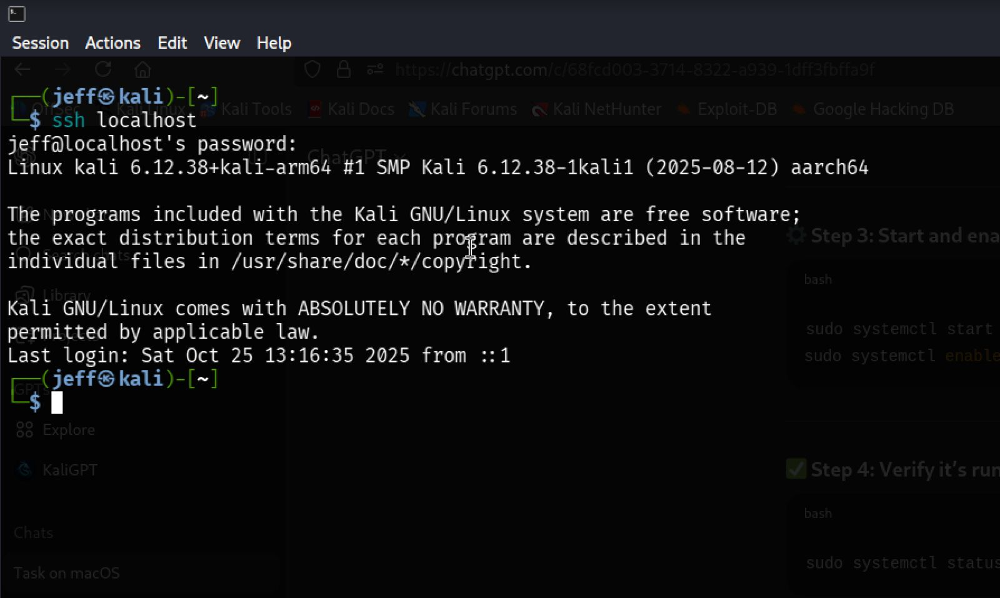

# UFW FIREWALL CONFIGURATION ON KALI LINUX

## REPOSITORY OVERVIEW

This repository documents the complete configuration and implementation of UFW (Uncomplicated Firewall) on Kali Linux. It serves as a comprehensive guide for setting up and managing firewall rules to secure network access on penetration testing and security-focused Linux distributions.

## ABOUT UFW FIREWALL

UFW (Uncomplicated Firewall) is a user-friendly command-line interface for managing iptables firewall rules on Linux systems. It simplifies the complex process of configuring network security policies, making it accessible for both beginners and experienced administrators.

### Why Use UFW on Kali Linux?

- Simplifies firewall management compared to raw iptables commands
- Provides essential security layer for penetration testing environments
- Allows precise control over inbound/outbound network traffic
- Helps prevent unauthorized access while maintaining necessary services
- Essential for securing SSH and other critical network services

## REPOSITORY CONTENTS

This repository contains step-by-step visual documentation of the entire UFW configuration process, along with a detailed PDF report summarizing the setup.

## Visual Step-by-Step

### Step 1: Enabling UFW Firewall
Shows the initial activation of UFW on the Kali Linux system and demonstrates the command used to enable firewall protection.

### Step 2: Checking UFW Status
Displays detailed status output including all active rules, port configurations, and security policies in effect.

### Step 3: Testing SSH Connection
Verifies that SSH (port 22) connectivity works properly and demonstrates successful remote access through configured firewall.

### Step 4: Configuring UFW Rules for Ports 22 and 23
Shows allow rule for SSH (port 22) and deny rule for Telnet (port 23), demonstrating selective port access control.

### Step 5: Testing Blocked Port 23
Confirms that denied ports are properly blocked and validates firewall rules are functioning as intended.

